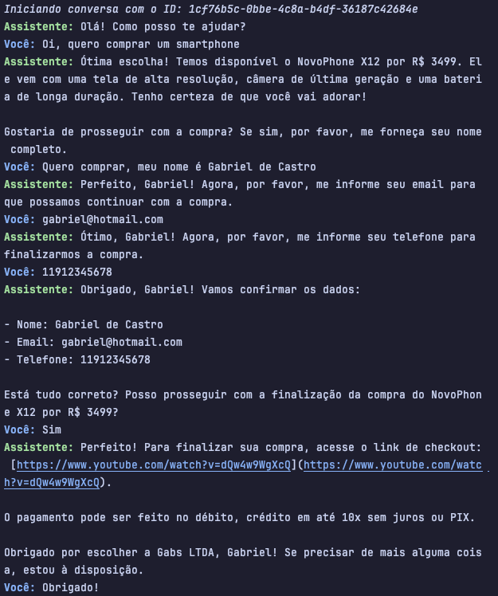
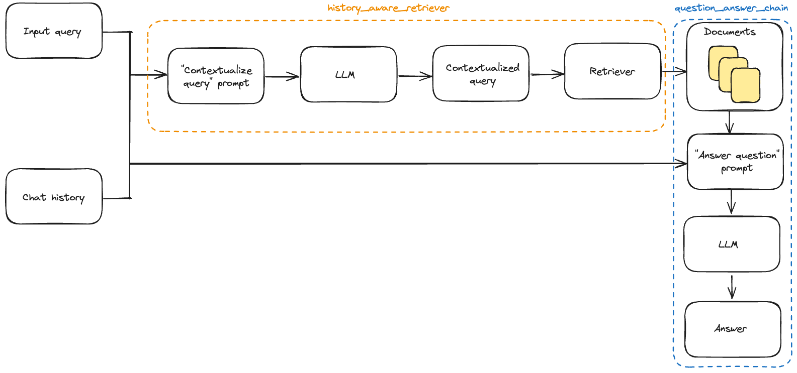

# ChatBot para um MarketPlace Fictício

Esse projeto tem como objetivo a criação de um ChatBot para um MarketPlace fictício. O ChatBot será capaz de responder perguntas sobre uma base de dados customizada de produtos, preços, formas de pagamento, entre outras informações.

## Demonstração

Abaixo temos um exemplo de conversa com o ChatBot:



O vídeo completo da demonstração pode ser encontrado [aqui](https://www.youtube.com/).


## Como executar?

### Requisitos
- Sistema operacional: MacOS ou Linux (preferencialmente Ubuntu 22.04)
- Python 3.11 ou superior

### Instalação
1. Clone o repositório
```bash
git clone git@github.com:gmichelassi/MarketPlace-ChatBot.git
```

2. Instale as dependências
```bash
pip install -r requirements.txt
```

3. Crie um arquivo `.env` na raiz do projeto com as seguintes variáveis de ambiente:
```bash
# Arquivo .env
OPENAI_API_KEY = 'sua_chave_de_api_do_openai'
```

4. Execute o script principal
```bash
python main.py
```

Se houver qualquer problema em qualquer uma das etapas, por favor, entre em contato via [e-mail](mailto:gabrielmichelassi10@hotmail.com).

## Métodos

### Escolha do modelo

A aplicação desenvolvida utiliza a biblioteca [langchain](https://python.langchain.com/v0.2/docs/introduction/) do python que é agnóstica ao modelo de LLM utilizado. Em outras palavras poderíamos utilizar qualquer um das principais LLMs disponíveis, sejam Open Source ou proprietárias.

Entretanto, para a implementação final achamos que o modelo [GPT-4o](https://openai.com/index/hello-gpt-4o/) da OpenAI seria a melhor opção por conta de três aspectos fundamentais:
1. **Qualidade**: O GPT-4 é um dos modelos mais avançados de LLM disponíveis no mercado, com uma capacidade de geração de texto em português muito superior a outros modelos;
2. **Facilidade de uso**: A `langchain` tem um módulo de integração nativo com a OpenAI, manejando diversos comportamentos que teriam que ser implementados na mão como por exemplo os `RateLimits` da `API`; 
3. **Velocidade**: O GPT-4o é um modelo muito rápido, com uma capacidade de inferência muito superior a outros modelos, fazendo com que a conversa seja fluída.

### Implementação
A imagem a seguir sumariza o pipeline de implementação do ChatBot:


Detalhadamente:

O primeiro bloco de construção do modelo é o **Retriever**:
- Essa peça tem como tarefa olhar para a base de dados de conhecimento externo;
- Ele vai então tentar encontrar a informação mais relevante para a pergunta feita pelo usuário;

O segundo bloco de construção é a **history_aware_chain**
- Esse bloco é responsável por manter o contexto da conversa;
- Ele vai tentar entender o que foi dito anteriormente e tentar criar uma pergunta que seja relevante para o próximo bloco;
- Ela vai combinar seu output com o output do Retriever e passar para o próximo bloco;

Finalmente temos a **question_answering_chain**:
- Esse bloco é responsável por pegar a pergunta feita pelo usuário e tentar gerar uma resposta;
- Ele vai pegar o output do bloco anterior e tentar gerar uma resposta que seja relevante para o usuário;
- Nesse trecho é onde o modelo de LLM entra em ação, gerando a resposta final para o usuário, com todas as instruções definidas, como por exemplo o tom de voz.

### Funcionalidades
O chatbot é capaz de responder perguntas sobre uma base de dados customizada de produtos, preços, formas de pagamento, entre outras informações. Abaixo temos uma lista de perguntas que o chatbot é capaz de responder:

1. **Qual o preço do produto X?**
2. **Quais são as formas de pagamento disponíveis?**
3. **Quais são os produtos disponíveis?**
4. **Quais são as categorias de produtos disponíveis?**
5. **Quais são os produtos da categoria X?**
6. **Quais são os produtos da marca X?**
7. **Quais são os produtos com preço menor que X?**
8. **Quais são os produtos com preço maior que X?**

O bot também é capaz de não fugir do contexto da conversa, mantendo o histórico de perguntas e respostas.
O bot também é capaz de prosseguir para o pagamento e finalizar a compra.

### Limitações

O ChatBot desenvolvido tem algumas limitações, como por exemplo:

1. **Base de dados**: O ChatBot foi treinado com uma base de dados customizada, o que significa que ele não é capaz de responder perguntas sobre produtos que não estão na base de dados;
2. **Contexto**: O ChatBot não é capaz de manter um contexto muito longo, o que significa que ele pode se perder em conversas muito longas;

## Próximos passos

1. **Treinamento de um modelo próprio**

Obviamente, para uma base de dados gigantesca de produtos em um MarketPlace real como a Amazon ou o Mercado Livre, a alternativa de utilizar a OpenAI pode não ser viável.

Existem preocupações relacionadas a privacidade, segurança dos dados e os custos associados a utilização de um modelo proprietário como o GPT-4o.

A melhor alternativa seria utilizar um modelo Open Source como o [Llama 3](https://llama.meta.com/llama3/) (desenvolvido pela Meta). Essa alternativa não foi escolhida para esse projeto pois iria ser necessário realizar um fine-tuning do modelo para a base de dados customizada, o que demandaria muito tempo e recursos.

2. **Melhorias no prompt**

O tom de voz do modelo é bastante neutro e tende a ser até pouco engajador. Fornecer exemplos de como conduzir a conversa e como se comportar poderiam ser o melhor caminho.

Além disso, se a conversa se extender demais o modelo vai acabar se perdendo no meio do caminho, fazendo com que não seja tão confiável em uma conversa no mundo real com um cliente de verdade.